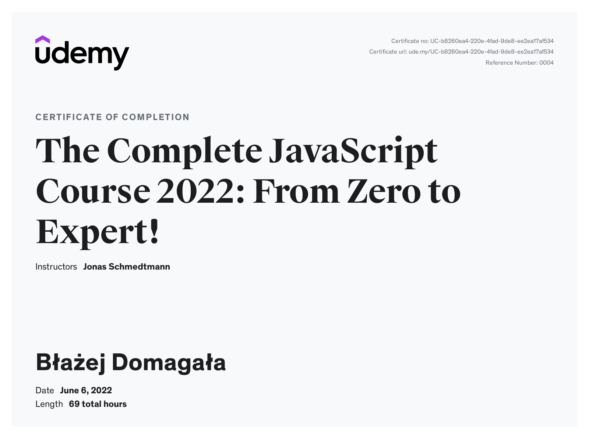

# Complete JavaScript Course

The repository contains all the files and all the code I wrote during the course [The Complete JavaScript Course 2022: From Zero to Expert!](https://www.udemy.com/course/the-complete-javascript-course) on the udemy platform.
  The repository also contains the tasks that were to be completed under the challenges.

## 00-Web-Developer
This folder marks external courses and other test codes for websites that help me learn JavaScript. The whole repository is mainly JS oriented, but you can't skip HTML and CSS in learning JS, adding the 00 folder for deeper knowledge.

To learn about HTML and CSS, I took a course on the udemy platform [Build Responsive Real-World Websites with HTML and CSS](https://www.udemy.com/course/design-and-develop-a-killer-website-with-html5-and-css3/). Thanks to this, it will improve my skills in building websites. It will strengthen my foundations.

> I am adding this information to make it clear that this section is not included in the course and it is my own initiative.

## Knowledge
The acquired knowledge will allow me to use JavaScript freely, which will allow me to further develop frameworks.
> A detailed description is available on the course website.

## Live Demo
I share the best projects created during the course as hosted pages available at the link.
### Pig Game
* A game made during the course. 
* It is about scoring 50 points in the total table.
* Live version available for playing in the browser. [Game here!](https://petitoff-dice-game.netlify.app/)

## Certificate
